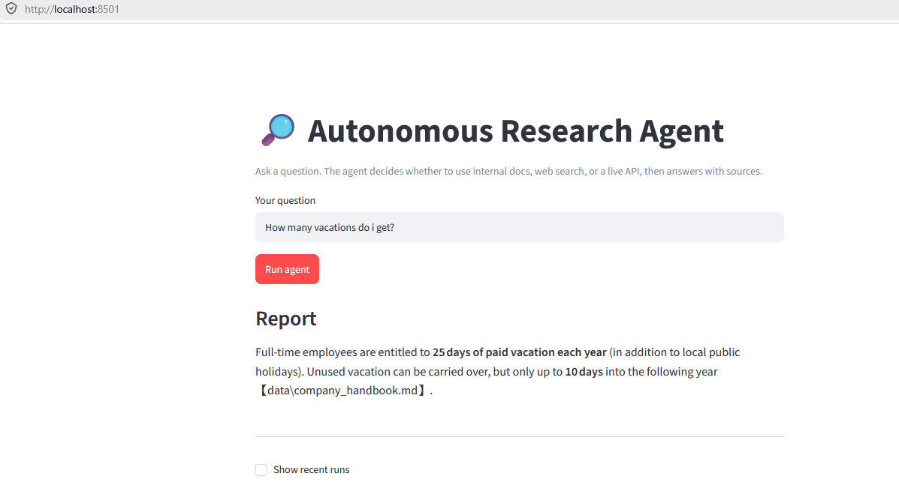

# Autonomous Research & Report Agent


An autonomous AI agent that researches questions by combining its own private
knowledge base (RAG) with live web search and external APIs, then answers with
cited sources — coordinated by a LangGraph agent (single or multi-agent), served
over a FastAPI backend, and usable from a browser UI. Built milestone by milestone,
from scratch, to understand every component rather than treat any of it as a black box.



## What it does today
- **Clickable web app**: a Streamlit UI + FastAPI backend — type a question in the
  browser and get a cited report. The agent is served over HTTP (`POST /run`,
  `GET /runs`), so any front-end can consume it.
- **Autonomous tool use**: given a question, a LangGraph agent decides which tools to
  call — its internal document store, live web search, or an external API — and
  combines the results into one cited answer. No hardcoded routing.
- **Three real tools**:
  - `search_knowledge_base` — the full hybrid RAG retriever over internal docs.
  - `web_search` — live web results via Tavily.
  - `get_exchange_rate` — a live external API call (currency conversion), wired into
    the research agent with a timeout, host allow-list, and graceful error handling.
- **Plan-and-execute research**: for complex goals, a LangGraph pipeline drafts an
  ordered plan, executes each step with the tool-using agent, critiques its own draft
  (reflection), does one targeted re-research pass for gaps, and synthesizes a cited
  report that flags its own limitations.
- **Multi-agent supervisor**: a supervisor agent coordinates specialists — a Researcher
  (web + knowledge-base tools), an Analyst (reasoning), and a Writer (report) — routing
  between them via structured decisions until the report is done, with per-specialist
  error handling.
- **Provider-agnostic LLM**: swap models/providers by changing one config value, no code
  changes. (Proven in practice: migrated across Groq models — including a deprecation —
  with one-line changes.)
- **Persistent memory**: per-conversation memory via a LangGraph checkpointer; a SQLite
  run-history store (`app/history.py`) that logs every run and survives restarts.
- **Hybrid retrieval stack**: semantic (vector) + keyword (BM25) search, fused with a
  hand-implemented Reciprocal Rank Fusion (RRF), cross-encoder reranking, and metadata
  filtering. Grounded generation cites sources and says "I don't know" when the context
  lacks the answer.

## Why hybrid retrieval
Keyword and semantic search fail in opposite ways: keyword nails exact terms but misses
synonyms; vector matches meaning but fuzzes rare codes. Fusing both hedges against not
knowing the query type in advance. A cross-encoder reranker then reads the query and each
candidate passage together for a sharper final ordering.

## Evaluation (measured, not assumed)
A small hand-built eval harness (`eval_retrieval.py`) scores retrieval on a 15-question
gold set using **hit rate@k** and **MRR**, comparing vector-only, hybrid (RRF), and
hybrid+rerank.

| Method (k=1) | Hit rate@1 | MRR |
|---|---|---|
| Vector-only | 1.00 | 1.000 |
| Hybrid (RRF) | 0.80 | 0.800 |
| Hybrid + rerank | 0.87 | 0.867 |


**Honest finding:** on this small, clean corpus, plain vector search already ranks the
correct chunk first every time, so hybrid fusion and reranking add noise rather than
value here. These techniques are insurance for large, noisy corpora — the harness is
built to show that crossover as the corpus grows, and to catch regressions. The point:
retrieval complexity is added based on measurement, not by default.

### Answer quality (LLM-as-judge)
An LLM-as-judge harness (`eval_answers.py`) scores generated answers on a 5-question set:

| Metric | Score | Meaning |
|---|---|---|
| Faithfulness | 100% | every answer claim is supported by the retrieved context (no hallucination) |
| Correctness | 80% | one answer was true but omitted a secondary detail (a completeness gap, not a hallucination) |

The split matters: **faithfulness** proves the grounding prompt prevents hallucination;
**correctness** caught a generation-side completeness gap that retrieval metrics can't see —
pointing the fix at the answer prompt, not the retriever. (The judge is itself an LLM, so
scores are directional and best for relative comparison and regression-catching, not ground truth.)


## Architecture at a glance
- **UI → API → agent**: a thin Streamlit UI calls a FastAPI backend, which runs the
  agent. The UI holds no logic — the API is the stable contract, so the front-end could
  be swapped (React, Slack bot, etc.) without touching the agent.
- **LangChain** provides the parts (model wrapper, tools, loaders, splitters);
  **LangGraph** provides the wiring (a stateful graph that loops, branches, persists).
- **Tools are how the agent acts**: each is a small, well-described function; the model
  reads the docstrings to choose which to call. Network tools use timeouts, return
  errors instead of raising, and restrict where they can go.
- **Two database families, on purpose**: a vector DB (Chroma) for semantic knowledge and
  a relational DB (SQLite) for run history — each chosen for the question it answers.
  Designed to graduate to Qdrant/pgvector and Postgres at scale.

## Stack
- **LLM**: Groq (`openai/gpt-oss-120b`) via a swappable factory
- **Agent framework**: LangGraph (StateGraph, ToolNode, supervisor, checkpointer) + LangChain
- **Web search**: Tavily (agent-focused search API)
- **Embeddings**: `BAAI/bge-small-en-v1.5` (local, free)
- **Vector DB**: Chroma (persisted locally)
- **Keyword / rerank**: `rank_bm25`, `sentence-transformers` cross-encoder
- **Persistence**: SQLite (run history + optional agent-state checkpoints)
- **API / UI**: FastAPI + Streamlit

## Setup

**Prerequisites:** Python 3.11+ and free API keys from [Groq](https://console.groq.com)
(the LLM) and [Tavily](https://tavily.com) (web search).

```bash
# 1. Clone and enter the project
git clone https://github.com/<AhsanAnalytics>/autonomous-research-agent.git
cd autonomous-research-agent

# 2. Create and activate a virtual environment (Windows PowerShell)
python -m venv .venv
.\.venv\Scripts\Activate.ps1

# 3. Install dependencies
pip install -r requirements.txt

# 4. Add your API keys: copy .env.example to .env, then fill in the keys
copy .env.example .env

# 5. Build the vector index from the documents in data/
python ingest.py
```

**Run it — command line:**

```bash
python ask.py "How many days off do I get?"                 # RAG Q&A
python research_agent.py "What laptops can new hires choose?"    # tool-using agent
python research_pipeline.py "Compare our NW-3000 warranty to typical routers"  # research pipeline
python supervisor_agent.py "Compare our NW-3000 warranty to typical routers"   # multi-agent team
```

**Run it — web app (two terminals):**

```bash
# Terminal 1 — the API backend
python -m uvicorn app.server:app --port 8000

# Terminal 2 — the UI (opens in your browser at http://localhost:8501)
python -m streamlit run ui.py
```

## Status
Actively developed. Completed: environment + safe secret handling, first LLM call,
structured output, a hand-built agent loop, the RAG core, hybrid retrieval
(BM25 + vector + RRF + reranking + metadata filtering), databases + persistent memory,
a LangGraph rebuild with checkpointed memory, real tools with autonomous tool choice
(RAG, web search, external API), a plan-and-execute research pipeline with reflection,
a supervisor multi-agent system, and a FastAPI + Streamlit product wrapper. Planned:
an evaluation set to measure retrieval/agent quality, plus shipping polish (tests, CI,
Docker).

## What I'd do next
- Scale retrieval to Qdrant or pgvector as the corpus grows (the eval harness would
  show hybrid/rerank overtaking vector search on a larger, noisier corpus).
- Add response streaming to the UI so the agent's steps appear live.
- Deploy the API + UI to a free-tier host for a public demo link.
- Expand the eval set and add agent-completion metrics.
